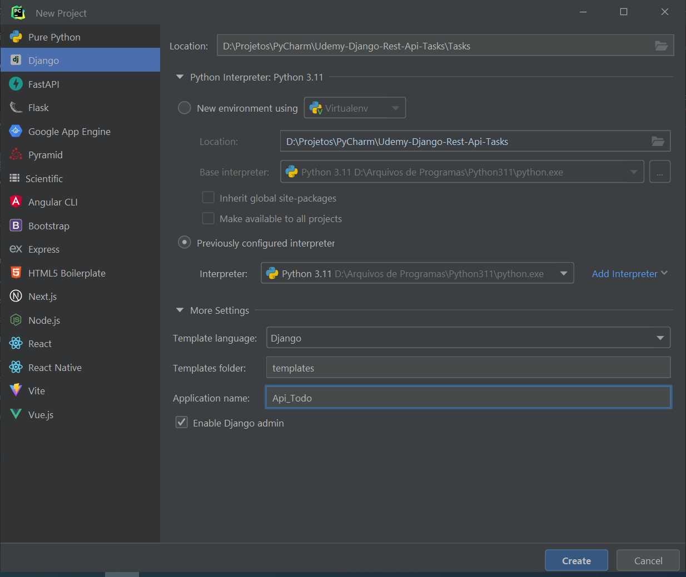

# Django RestFull Api - TODO List
Projeto de uma RESTful API em Python com framework Django Rest Framework.

Obs.: Em relação ao projeto original "Api_Todo" equivale a "app", e "Tasks" a "api".

## Instalação das dependências do Django e do Projeto
- `pip install django`
- `pip install djangorestframework`
- `pip install markdown # Suporte Markdown para a API navegável`
- `pip install django-filter # Suporte de filtragem`
- `pip install pillow # Suporte para imagens`

## Comandos no terminal
- `django-admin startproject Tasks .` # cria projeto Django com nome "Tasks"
- `python manage.py makemigrations` # cria alterações no banco de dados de acordo com modificações das models
- `python manage.py migrate` # aplica as migrations
- `python manage.py runserver` # executa a aplicação

## Passos
Criar aplicação:

1. Criar projeto no PyCharm ou com ou `django-admin startproject Tasks .`

2. Caso a pasta "Tasks" ou "app" não tenha sido criado, use `python manage.py startapp Tasks` 
ou `python manage.py startapp app`
3. Em Tasks > settings.py > INSTALLED_APPS, adicionar 'rest_framework', 
e também 'Api_Todo.apps.ApiTodoConfig', caso não esteja adionado. 
4. Em Api_Todo > models.py, criar classe Task com seus devidos campos.
5. Em Api_Todo criar serializers.py, e a classe TaskSerializer dentro deste arquivo.
6. Em Api_Todo > views.py, criar um método para tratar GET e POST.
7. Em Api_Todo > urls.py, adicionar caminho para a função criada anteriormente.
8. Em Tasks > urls.py, adicionar a rota 'todo/'.
6. Em Api_Todo > views.py, criar uma função task_detail_update_delete_id para tratar get, put, delete por id.
7. Em Api_Todo > urls.py, adicionar uma rota para a nova função de view.
8. Criar migrations com `python manage.py makemigrations`.
9. Aplicar migrations com `python manage.py migrate`.
10. Executar a aplicação pelo PyCharm ou com python manage.py runserver.

Obs.: Pode ser necessário renomear o diretório raiz para "Tasks" para executar o projeto.

## Referências
Udemy - Aprenda Django REST Framework do Zero:
https://www.udemy.com/course/aprenda-django-rest-framework-do-zero/